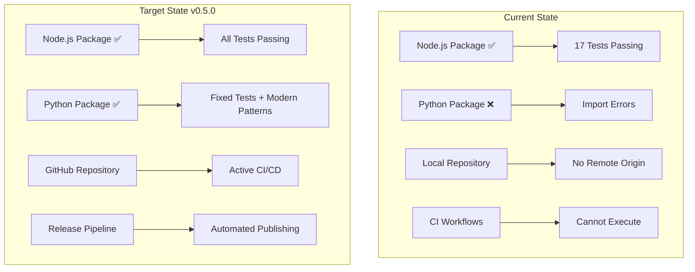
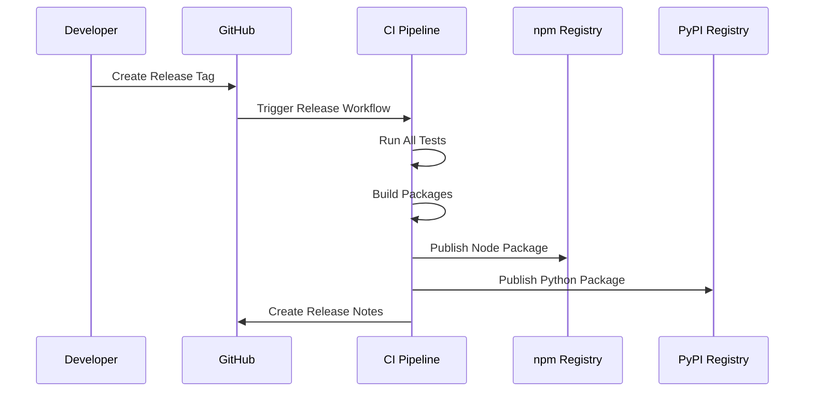

# Design Document

## Overview

This design addresses the critical path to v0.5.0 release by fixing the broken Python package, establishing proper GitHub repository infrastructure, and implementing automated release processes. The design prioritizes immediate functionality restoration while building sustainable development and release workflows.

## Architecture

### Current State Analysis



### Fix Strategy

The design follows a phased approach:

1. **Phase 1**: Fix Python package and restore functionality
2. **Phase 2**: Establish GitHub repository and CI/CD
3. **Phase 3**: Implement release automation
4. **Phase 4**: Validate and document

## Components and Interfaces

### Python Package Modernization

**Problem**: Current tests use deprecated `gitlint.tests.base.BaseTestCase` which doesn't exist in modern gitlint versions.

**Solution**: Refactor to use standard pytest patterns with gitlint's public API.

```python
# Current (Broken)
from gitlint.tests.base import BaseTestCase

class TestRaiFooterExists(BaseTestCase):
    def test_example(self):
        commit = self.gitcommit("message")  # Doesn't exist

# New (Working)
from gitlint.git import GitCommit
from gitlint.rules import CommitMessageTitle, CommitMessageBody

class TestRaiFooterExists:
    def test_example(self):
        commit = GitCommit.from_commit_msg("message")
```

### GitHub Repository Setup

**Components**:
- Repository creation at `CheckMarKDevTools/rai-lint`
- Branch protection rules for main branch
- Secrets configuration for npm and PyPI tokens
- Issue and PR templates migration

**Integration Points**:
- Existing `.github/workflows/` directory structure
- Current CI matrix configuration
- Existing documentation and examples

### Release Pipeline Architecture



## Data Models

### Version Management

```typescript
interface VersionConfig {
  current: string;        // "0.1.0"
  target: string;         // "0.5.0"
  node: string;          // Package version for Node.js
  python: string;        // Package version for Python
  releaseType: 'major' | 'minor' | 'patch';
}
```

### Test Configuration

```python
@dataclass
class TestCommit:
    message: str
    expected_valid: bool
    expected_violations: int
    description: str
```

## Error Handling

### Python Package Fixes

**Error Categories**:
1. **Import Errors**: Missing gitlint.tests module
2. **API Compatibility**: Deprecated BaseTestCase usage
3. **Test Execution**: Pytest collection failures

**Resolution Strategy**:
- Replace deprecated imports with modern gitlint API
- Use standard pytest fixtures instead of BaseTestCase
- Implement proper GitCommit object creation

### CI/CD Error Handling

**Failure Scenarios**:
1. **Test Failures**: Any test failure blocks release
2. **Build Failures**: TypeScript compilation or Python packaging errors
3. **Publishing Failures**: npm or PyPI authentication/upload issues

**Recovery Mechanisms**:
- Automatic retry for transient failures
- Clear error reporting with actionable messages
- Rollback capabilities for failed releases

## Testing Strategy

### Python Package Testing

**Test Structure Modernization**:
```python
# New test pattern
import pytest
from gitlint.git import GitCommit
from checkmark_rai_lint.rules import RaiFooterExists

class TestRaiFooterExists:
    @pytest.fixture
    def rule(self):
        return RaiFooterExists()
    
    def test_valid_footer(self, rule):
        commit = GitCommit.from_commit_msg(
            "feat: add feature\n\nGenerated-by: AI Tool <ai@example.com>"
        )
        violations = rule.validate(commit)
        assert len(violations) == 0
```

### Integration Testing

**End-to-End Validation**:
1. **Git Hook Integration**: Test actual commit workflows
2. **Multi-Language Consistency**: Verify identical behavior
3. **Performance Testing**: Ensure acceptable validation speed
4. **Compatibility Testing**: Verify across all supported versions

### CI Matrix Validation

**Test Matrix**:
- Node.js: 16.x, 18.x, 20.x, 24.x
- Python: 3.9, 3.10, 3.11, 3.12
- OS: Ubuntu (primary), with future macOS/Windows support

## Implementation Phases

### Phase 1: Python Package Recovery (Priority: Critical)

**Scope**: Fix broken Python tests and restore functionality
**Timeline**: Immediate
**Dependencies**: None

**Tasks**:
- Analyze current gitlint API and available test utilities
- Refactor test files to use modern pytest patterns
- Update imports to use public gitlint APIs
- Verify test coverage and functionality

### Phase 2: Repository Infrastructure (Priority: High)

**Scope**: Establish GitHub repository and basic CI/CD
**Timeline**: After Phase 1 completion
**Dependencies**: Working Python package

**Tasks**:
- Create GitHub repository
- Push existing codebase
- Configure branch protection
- Validate CI workflows execute successfully

### Phase 3: Release Automation (Priority: Medium)

**Scope**: Implement automated publishing to npm and PyPI
**Timeline**: After Phase 2 validation
**Dependencies**: Working CI/CD pipeline

**Tasks**:
- Configure publishing secrets
- Test dry-run releases
- Implement version management
- Create release documentation

### Phase 4: Documentation and Validation (Priority: Low)

**Scope**: Update documentation and perform final validation
**Timeline**: Pre-release
**Dependencies**: Working release pipeline

**Tasks**:
- Update installation guides
- Validate all examples work
- Performance testing
- User acceptance testing

## Risk Mitigation

### Technical Risks

1. **Gitlint API Changes**: Modern gitlint may have breaking changes
   - *Mitigation*: Thorough API research and compatibility testing

2. **CI/CD Complexity**: Multi-language pipeline complexity
   - *Mitigation*: Incremental implementation with validation at each step

3. **Publishing Failures**: npm/PyPI authentication or policy issues
   - *Mitigation*: Dry-run testing and manual fallback procedures

### Project Risks

1. **Timeline Pressure**: Rushing to v0.5.0 may introduce bugs
   - *Mitigation*: Phased approach with validation gates

2. **Compatibility Issues**: Breaking changes between versions
   - *Mitigation*: Comprehensive testing matrix and gradual rollout

## Success Criteria

### Phase 1 Success
- [ ] All Python tests pass
- [ ] Python package installs without errors
- [ ] Integration tests demonstrate working functionality

### Phase 2 Success
- [ ] GitHub repository is public and accessible
- [ ] All CI workflows execute successfully
- [ ] Code quality checks pass

### Phase 3 Success
- [ ] Dry-run releases complete successfully
- [ ] Version management works correctly
- [ ] Publishing pipeline is validated

### v0.5.0 Release Success
- [ ] Both packages published to registries
- [ ] Documentation is accurate and complete
- [ ] All supported environments validated
- [ ] Performance benchmarks meet requirements