<div align="center">


**Stop playing hide-and-seek with AI in your commits.**

_A dual-language validation framework that makes AI attribution non-negotiable._

---

### 📊 Project Stats

[](https://github.com/ChecKMarKDevTools/rai-lint/stargazers) [](https://github.com/ChecKMarKDevTools/rai-lint/issues) [](https://github.com/ChecKMarKDevTools/rai-lint/releases) [](LICENSE)

[](https://sonarcloud.io/summary/new_code?id=ChecKMarKDevTools_rai-lint) [](https://sonarcloud.io/summary/new_code?id=ChecKMarKDevTools_rai-lint) [](https://sonarcloud.io/summary/new_code?id=ChecKMarKDevTools_rai-lint) [](https://sonarcloud.io/summary/new_code?id=ChecKMarKDevTools_rai-lint) [](https://sonarcloud.io/summary/new_code?id=ChecKMarKDevTools_rai-lint)

### 🗣️ Languages

[](https://developer.mozilla.org/en-US/docs/Web/JavaScript) [](https://www.typescriptlang.org/) [](https://www.python.org/)

### 📦 Packages

[](https://www.npmjs.com/package/@checkmarkdevtools/commitlint-plugin-rai) [](https://pypi.org/project/checkmarkdevtools-gitlint-plugin-rai/)

### 🤖 AI & Automation

[](https://verdent.ai) [](https://github.com/features/copilot)

### 🔧 Quality & Standards

[](https://conventionalcommits.org/) [](https://commitlint.js.org/) [](https://eslint.org/)  

---

[Installation](#-installation) • [Quick Start](#-quick-start) • [Attribution Formats](#%EF%B8%8F-ai-attribution-formats) • [Documentation](#-documentation)

</div>

---

## 🤖 What is this?

CheckMarK RAI Lint enforces **Responsible AI (RAI) attribution** in every commit. No more "who wrote this?" moments. No more mystery code. Just honest, trackable AI contributions.

```mermaid
%%{init: {'theme':'dark'}}%%
flowchart LR
    A[Developer Commits] --> B{Has AI Footer?}
    B -->|Yes| C[Commit Accepted ✅]
    B -->|No| D[Commit Rejected ❌]
    C --> E[Clear AI Attribution]
    D --> F[Add Footer & Retry]
```



### Why does this exist?

Because transparency matters. When AI writes code, everyone should know. This isn't about fear or compliance theater—it's about building trust and maintaining clear audit trails.

---

## 🎯 Features

<table>
<tr>
<td width="50%">

### 🔒 **Enforcement by Default**

Blocks commits without valid AI attribution footers. No exceptions.

### 🌍 **Dual-Language Support**

Native plugins for both JavaScript/TypeScript (`commitlint`) and Python (`gitlint`).

</td>
<td width="50%">

### 📊 **Five Attribution Levels**

From human-only to AI-generated, track exactly who did what.

### ⚡ **Zero Config Start**

Works out-of-the-box with sensible defaults. Customize when ready.

</td>
</tr>
</table>

---

## 🏷️ AI Attribution Formats

Every commit **must** include one of these Git trailer footers:

<table>
<thead>
<tr>
<th width="30%">Footer Format</th>
<th width="40%">When to Use</th>
<th width="30%">Example</th>
</tr>
</thead>
<tbody>
<tr>
<td><code>Authored-by</code></td>
<td>Human-only work, zero AI involvement</td>
<td><code>Authored-by: Jane Doe &lt;jane@example.com&gt;</code></td>
</tr>
<tr>
<td><code>Commit-generated-by</code></td>
<td>Trivial AI help (docs, messages, reviews)</td>
<td><code>Commit-generated-by: ChatGPT &lt;chatgpt@openai.com&gt;</code></td>
</tr>
<tr>
<td><code>Assisted-by</code></td>
<td>AI helped, but human did primary work</td>
<td><code>Assisted-by: GitHub Copilot &lt;copilot@github.com&gt;</code></td>
</tr>
<tr>
<td><code>Co-authored-by</code></td>
<td>Roughly 50/50 AI and human split</td>
<td><code>Co-authored-by: Verdent AI &lt;verdent@verdent.ai&gt;</code></td>
</tr>
<tr>
<td><code>Generated-by</code></td>
<td>Majority AI-generated code</td>
<td><code>Generated-by: GitHub Copilot &lt;copilot@github.com&gt;</code></td>
</tr>
</tbody>
</table>

> **Note:** All patterns are case-insensitive and follow the [Git trailer format](https://git-scm.com/docs/git-interpret-trailers).

---

## 📦 Installation

### Node.js / Commitlint

```bash
npm install --save-dev @checkmarkdevtools/commitlint-plugin-rai
```

**Configure in `commitlint.config.js`:**

```javascript
export default {
  extends: ['@commitlint/config-conventional'],
  plugins: ['@checkmarkdevtools/commitlint-plugin-rai'],
  rules: {
    'ai-attribution-exists': [2, 'always'],
  },
};
```

### Python / Gitlint

```bash
uv add checkmarkdevtools-gitlint-plugin-rai
```

**Configure in `.gitlint`:**

```ini
[general]
contrib = checkmark_rai_lint.rules.RaiFooterExists
```

---

## 🚀 Quick Start

### Hook Integration

<details>
<summary><b>Lefthook</b></summary>

```yaml
pre-push:
  commands:
    sonar-scan:
      run: npx dotenv -- npx sonar-scanner

commit-msg:
  commands:
    commitlint:
      run: npx commitlint --edit {1}
```

</details>

<details>
<summary><b>Husky</b></summary>

```bash
npx husky add .husky/commit-msg 'npx commitlint --edit $1'
```

</details>

<details>
<summary><b>pre-commit</b></summary>

```yaml
repos:
  - repo: local
    hooks:
      - id: gitlint
        name: gitlint
        entry: gitlint
        args: [--msg-filename]
        language: python
        stages: [commit-msg]
```

</details>

---

## 📚 Documentation

| Document                                   | Description                    |
| ------------------------------------------ | ------------------------------ |
| [Installation Guide](docs/installation.md) | Detailed setup instructions    |
| [Usage Guide](docs/usage.md)               | How to use the plugins         |
| [API Reference](docs/api-reference.md)     | Complete API documentation     |
| [Architecture](docs/architecture.md)       | System design and internals    |
| [Deployment](docs/deployment.md)           | Publishing and release process |
| [Development](docs/development.md)         | Contributing guidelines        |
| [Troubleshooting](docs/troubleshooting.md) | Common issues and fixes        |

---

## 🛠️ Monorepo Structure

```
rai-lint/
├── packages/
│   ├── node-commitlint/          # Node.js/ESM plugin
│   │   ├── src/
│   │   │   ├── rules/
│   │   │   │   └── rai-footer-exists.ts
│   │   │   └── index.ts
│   │   └── package.json
│   │
│   └── python-gitlint/            # Python plugin
│       ├── checkmark_rai_lint/
│       │   ├── __init__.py
│       │   └── rules.py
│       └── pyproject.toml
│
├── docs/                          # Documentation
└── fixtures/                      # Test fixtures
```

---

## 🤝 Contributing

Contributions welcome! See [CONTRIBUTING.md](CONTRIBUTING.md) for guidelines.

---

## 📄 License

Look, I'm not gonna hide behind a wall of legalese here.

This runs on [Polyform Shield 1.0.0](./LICENSE). That's **not open source** — but before you rage-quit, hear me out.

**What this means in actual English:**

Use it. Break it. Fix it. Ship it in your CI pipeline at work. Hell, use it to enforce commit messages on your team and become the office villain. I'm cool with all of that.

What I'm _not_ cool with? Someone spinning this up as "AI Lint Pro" with a $99/month subscription and a fancy landing page. If you want to make money off this code, we should probably have a conversation first.

**The vibe:** This is a tool to solve a real problem — AI attribution in commits is messy, and someone needed to standardize it. If you're using it for that purpose, internal or otherwise, you're good. If you're thinking about monetizing it... let's chat.

Sound fair? Cool. Now go lint some commits. 🚀

---

## 🫶 Show Some Love

If you find this project useful or want to support its development, consider starring the repo or connecting with me!

[](https://www.buymeacoffee.com/anchildress1) [](https://dev.to/anchildress1) [](https://www.linkedin.com/in/anchildress1/)

---

<div align="center">

_Stop guessing. Start tracking._

**Co-authored-by: Verdent AI & GitHub Copilot**

</div>
