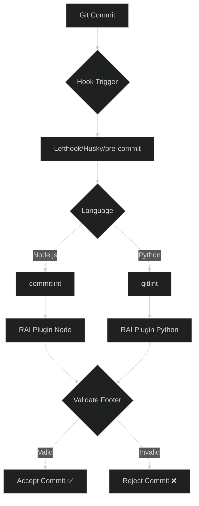

# Architecture Overview

CheckMarK RAI Lint is a dual-language monorepo implementing identical commit validation logic across Node.js and Python ecosystems.



## RAI Footer Validation Logic

Both implementations validate Git trailers (footers) using these patterns:

**Node.js** (regex-based):

```javascript
/^Authored-by:\s+[^<]+\s+<[^>]+>$/im
/^Commit-generated-by:\s+[^<]+\s+<[^>]+>$/im
/^Assisted-by:\s+[^<]+\s+<[^>]+>$/im
/^Co-authored-by:\s+[^<]+\s+<[^>]+>$/im
/^Generated-by:\s+[^<]+\s+<[^>]+>$/im
```

**Python** (trailer-aware):

- Parses Git trailers via gitlint's built-in parser
- Validates keys: `Authored-by`, `Commit-generated-by`, `Assisted-by`, `Co-authored-by`, `Generated-by` (case-insensitive)
- Validates value format: `^[^<]+ <[^>]+>$` (name + email in angle brackets)

All patterns require:

- Case-insensitive matching
- Name followed by contact in angle brackets (`Name <contact>`)
- Valid Git trailer format
