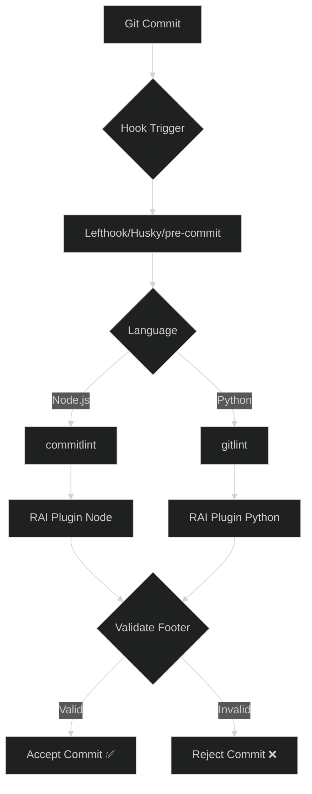

# Architecture Overview

CheckMarK RAI Lint is a dual-language monorepo implementing identical commit validation logic across Node.js and Python ecosystems.

## RAI Footer Validation Logic

Both implementations validate Git trailers (footers) using these patterns:

**Node.js**:

The Node implementation validates RAI footers directly from the raw commit message. It does not rely on structured trailer parsing, which keeps behavior explicit and easy to reason about when debugging failed commits.

- Scans commit messages using regex rules
- Matches known RAI footer keys:
  `Authored-by`, `Commit-generated-by`, `Assisted-by`, `Co-authored-by`, `Generated-by`
- Requires a readable name followed by contact info in angle brackets
  (`Name <contact>`)

**Python**:

The Python implementation intentionally mirrors Node’s behavior instead of relying on gitlint’s structured trailer parser. This keeps validation rules predictable across ecosystems and avoids subtle differences in how trailers are interpreted.

- Scans commit messages using regex rules
- Accepts the same footer keys as Node:
  `Authored-by`, `Commit-generated-by`, `Assisted-by`, `Co-authored-by`, `Generated-by`
- Requires a human-readable name followed by contact info in angle brackets
  (`Name <contact>`)

All patterns require:

- Case-insensitive matching
- Name followed by contact in angle brackets (`Name <contact>`)
- Valid Git trailer format
