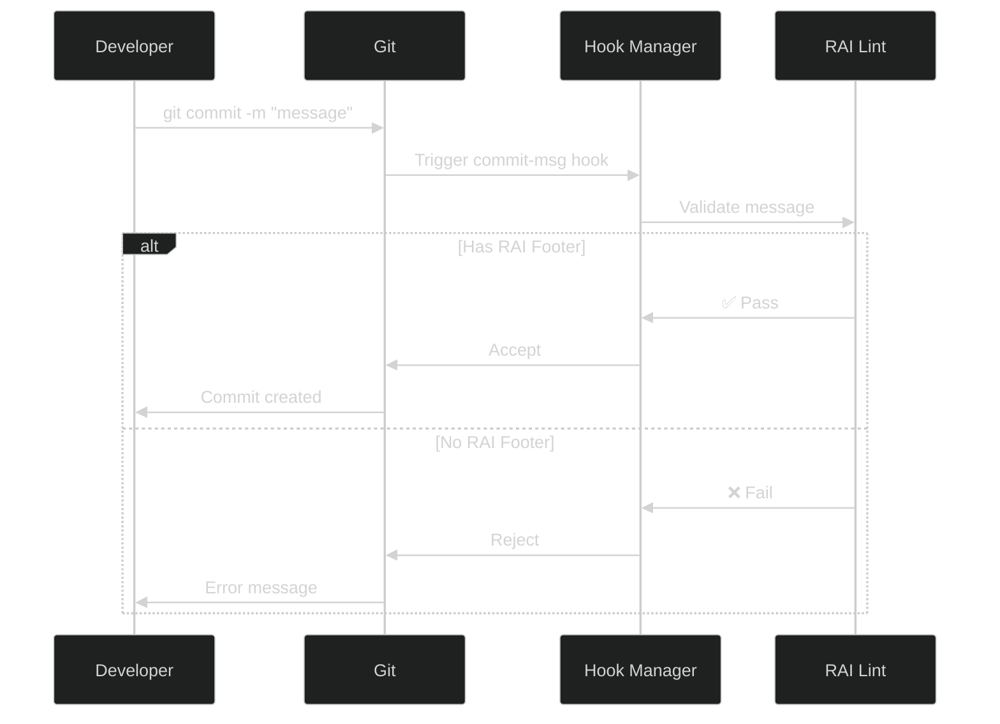

# Architecture Overview

## System Design

CheckMarK RAI Lint is designed as a dual-language monorepo implementing identical commit validation logic across Node.js and Python ecosystems.


## Component Architecture

### Node Package (`@checkmark/commitlint-plugin-rai`)

```
packages/node-commitlint/
├── src/
│   ├── index.ts           # Plugin entry point
│   └── rules/
│       ├── rai-footer-exists.ts
│       └── rai-footer-exists.test.ts
├── dist/                   # Compiled output
├── package.json
├── tsconfig.json
└── vitest.config.ts
```

**Key Design Decisions:**

- ESM-first with TypeScript for modern Node.js
- Commitlint Rule API compliance
- Regex-based pattern matching for flexibility
- Zero runtime dependencies (peer deps only)

### Python Package (`checkmark-rai-lint`)

```
packages/python-gitlint/
├── checkmark_rai_lint/
│   ├── __init__.py
│   └── rules.py            # RaiFooterExists rule
├── tests/
│   └── test_rules.py
├── pyproject.toml
└── .gitlint
```

**Key Design Decisions:**

- Gitlint contrib rule pattern
- Identical regex patterns to Node version
- Python 3.10+ baseline for compatibility
- Minimal dependencies (gitlint only)

## RAI Footer Validation Logic

Both implementations use identical validation patterns:

1. **Authored-by Pattern**: `^Authored-by:\s+.+\s+<.+@.+>$`
2. **Commit-generated-by Pattern**: `^Commit-generated-by:\s+.+\s+<.+@.+>$`
3. **Assisted-by Pattern**: `^Assisted-by:\s+.+\s+<.+@.+>$`
4. **Co-authored-by Pattern**: `^Co-authored-by:\s+.+\s+<.+@.+>$`
5. **Generated-by Pattern**: `^Generated-by:\s+.+\s+<.+@.+>$`

All patterns are:

- Case-insensitive (`re.IGNORECASE` / `i` flag)
- Multiline-aware (`re.MULTILINE` / `m` flag)
- Anchored to line boundaries (`^` and `$`)
- Follow Git trailer format with name and email

## Testing Strategy

### Shared Fixtures

Both packages share identical test fixtures to ensure parity:

```
fixtures/
├── commit-messages.ts      # Node fixtures
└── commit_messages.py      # Python fixtures
```

Test cases cover:

- ✅ Valid footers (all five patterns)
- ✅ Case insensitivity
- ❌ Missing footers
- ❌ Malformed footers
- ❌ Invalid footer text

### CI Matrix

Automated testing across:

- **Node**: 18, 20
- **Python**: 3.11, 3.12

Each matrix job runs:

- Linting (ESLint/Black/isort)
- Unit tests (Vitest/Pytest)
- Build verification (TypeScript compilation)

## Integration Points

### Hook Managers

The framework supports three major Git hook managers:

1. **Lefthook** (Recommended)
   - Fast, language-agnostic
   - YAML configuration
   - Parallel execution support

2. **Husky** (Node-focused)
   - Npm ecosystem standard
   - Simple shell scripts
   - Wide adoption

3. **pre-commit** (Python-focused)
   - Framework-agnostic
   - Extensive plugin ecosystem
   - YAML configuration

### Workflow Integration



## Extensibility

### Future Enhancement Points

1. **Custom Footer Patterns**
   - Configuration-based pattern definitions
   - Organization-specific footer formats

2. **Footer Templates**
   - CLI tools for footer generation
   - IDE snippets and integrations

3. **Reporting & Analytics**
   - AI attribution metrics
   - Compliance dashboards

4. **Multi-Repository Enforcement**
   - Centralized configuration
   - Organization-wide policies
